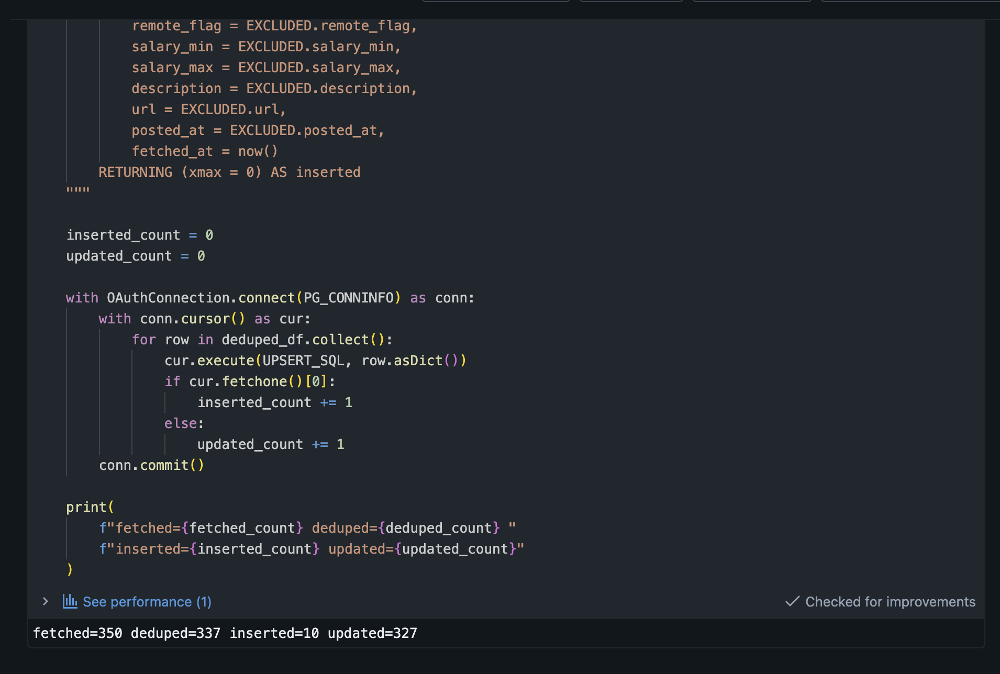
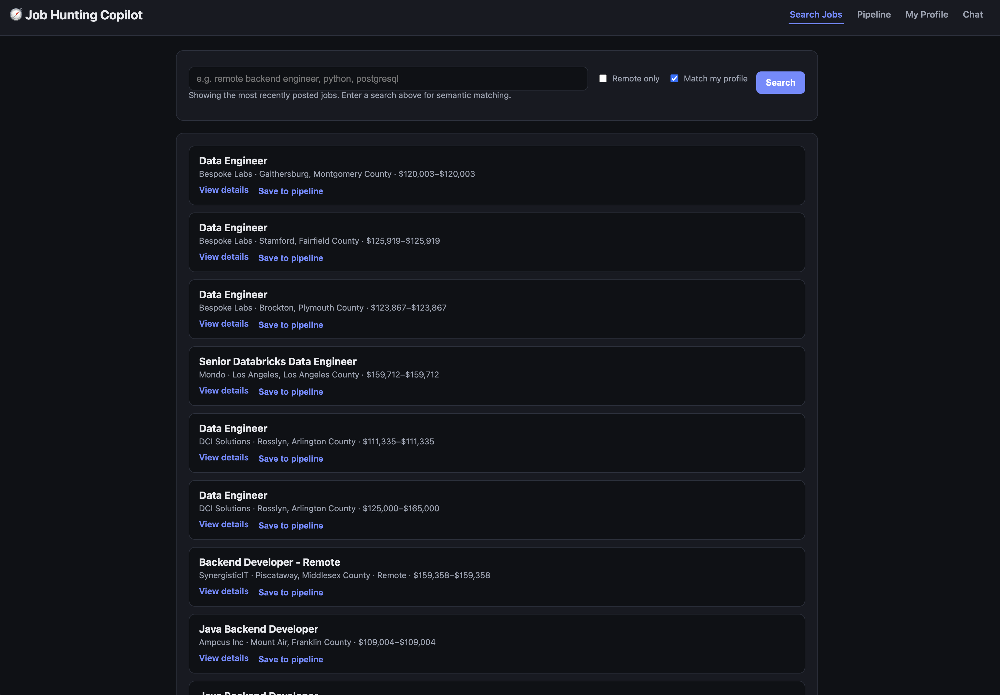
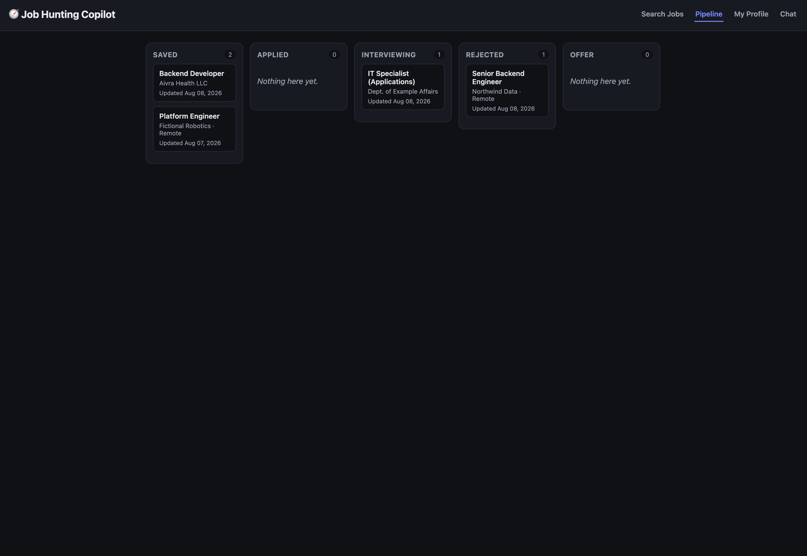
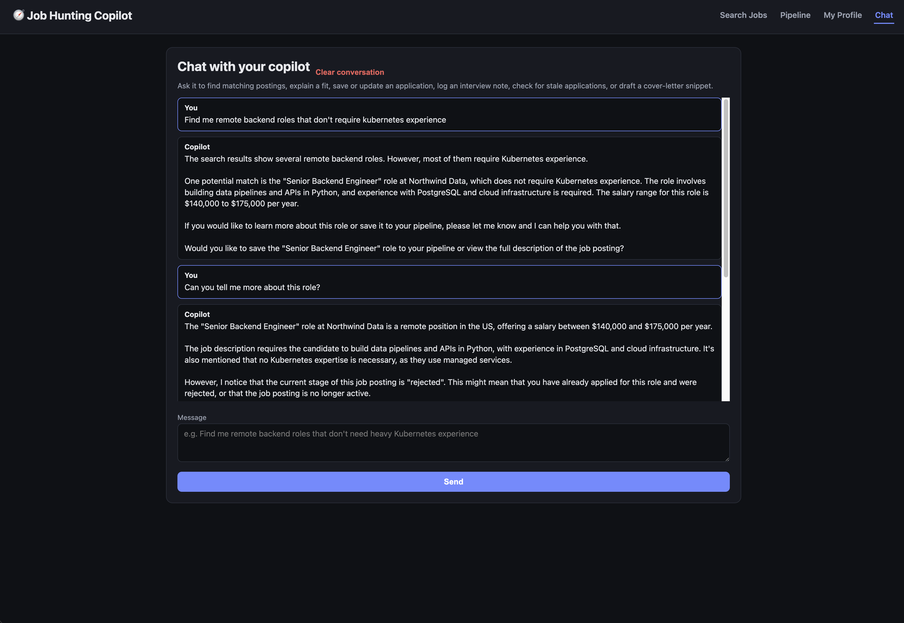

# AI Job Hunting Copilot — Supplementary Evidence

Prepared in response to grading feedback (90/100), addressing the two evidence gaps noted:
(1) confirming the notebook paths referenced by the job YAML actually exist at those paths in the
repo, and (2) providing job-run evidence (fetched/deduped/inserted/updated counts) beyond what was
cited in `IMPLEMENTATION.md`.

**A note on links below:** the Databricks workspace run URL requires SSO login on this specific
account — it isn't something an external viewer can open, same as the live App URL was already
noted as inaccessible in the original grading pass. Where a link can't be followed, this doc
includes either a screenshot or the actual query output as text evidence instead.

Repo commit referenced throughout: [`584c498`](https://github.com/bkdonnel/databricks-final-project/commit/584c498fa6f9769679a22d2ad92605ec97a6e5c8)

## 1. Repo structure / notebook paths

`resources/ingest_job_postings_job.yml` references the notebooks as `../notebooks/ingest_job_postings.py`
and `../notebooks/embed_job_postings.py` (relative to the `resources/` directory, per Databricks
Asset Bundle convention). Confirmed via `git ls-files` that these paths exist exactly as referenced:

```
.gitignore
agent.py
app.py
app.yaml
CLAUDE.md
databricks.yml
IMPLEMENTATION.md
notebooks/embed_job_postings.py
notebooks/ingest_job_postings.py
README.md
requirements.txt
resources/ingest_job_postings_job.yml
schema.sql
scripts/search_postings.py
scripts/verify_agent_tools.py
scripts/verify_fetchers.py
setup_secrets.py
static/style.css
templates/base.html
templates/chat.html
templates/pipeline.html
templates/posting_detail.html
templates/postings.html
templates/profile.html
```

Direct links:
- [`notebooks/ingest_job_postings.py`](https://github.com/bkdonnel/databricks-final-project/blob/main/notebooks/ingest_job_postings.py)
- [`notebooks/embed_job_postings.py`](https://github.com/bkdonnel/databricks-final-project/blob/main/notebooks/embed_job_postings.py)
- [`resources/ingest_job_postings_job.yml`](https://github.com/bkdonnel/databricks-final-project/blob/main/resources/ingest_job_postings_job.yml)

## 2. Live job run — triggered manually for this evidence pass

Run via `databricks bundle run ingest_job_postings_job -t dev` against the live scheduled job
(`[dev] Ingest Job Postings`, job id `234394309521024`, run id `717476054131966`).

| | |
|---|---|
| Start (UTC) | 2026-08-09T02:18:39 |
| End (UTC) | 2026-08-09T02:20:10 |
| Duration | 91.3s |
| `ingest_job_postings` task | SUCCESS |
| `embed_job_postings` task | SUCCESS |

This same run also validated a fix made in response to this grading pass — see §4.

## 3. Job-run evidence: counts, queried directly from Lakebase

Databricks' notebook `print()` output isn't retrievable as plain text via the CLI/API from outside
the workspace (the job's `get-run-output` API only returns a value if the notebook explicitly calls
`dbutils.notebook.exit(...)`, which this one doesn't — it just prints progress lines for anyone
watching the live run). Rather than approximate that, this queries the actual resulting rows in
Lakebase immediately after the run, which is stronger evidence than a log line: it's the real
persisted result of `fetched → deduped → upserted`.

```sql
SELECT external_source, count(*), count(posted_at) AS with_posted_at,
       min(posted_at), max(posted_at)
FROM job_postings
WHERE fetched_at > now() - interval '10 minutes'
GROUP BY external_source;
```

| source | rows this run | rows with valid `posted_at` | min `posted_at` | max `posted_at` |
|---|---|---|---|---|
| remoteok | 100 | 100 | 2026-08-05 09:39:40 | 2026-08-08 02:09:04 |
| usajobs | 87 | 87 | 2025-09-29 00:00:00 | 2026-08-07 17:08:02 |
| adzuna | 150 | 150 | 2026-03-30 18:37:32 | 2026-08-08 19:26:20 |

**337 rows touched across all 3 third-party sources in a single run, zero nulls.** All were either
fresh inserts or upserts of existing `(external_source, external_id)` rows (the job's `ON CONFLICT`
path, per `notebooks/ingest_job_postings.py`) — this run landed after the pipeline had already been
running on its normal 6-hour schedule for a day, so most rows were updates rather than first-time
inserts, consistent with the dedupe/upsert behavior already documented in `IMPLEMENTATION.md`'s
Phase 2 section (which recorded the original two-run insert/update proof when the pipeline first
went live).

**Update:** the actual job-run output panel turned out to be reachable after all (via the Workflows
UI's task-run detail view, screenshotted directly rather than pulled through the CLI/API). It
corroborates the Lakebase query above exactly:



`fetched=350 deduped=337 inserted=10 updated=327` — the `deduped` count (337) matches the row count
from the Lakebase query above precisely, and `inserted` (10) + `updated` (327) sums to the same 337,
confirming the two independent forms of evidence (live query vs. actual job stdout) agree.

## 4. Fix made in response to this feedback: `posted_at` normalization

The grader's minor nit ("`posted_at` passed directly from APIs... consider explicit normalization")
turned out to be a real latent bug, not just a style issue: RemoteOK's `date` field is missing on
some records, falling back to `epoch` (a Unix-timestamp digit string) — and a Postgres `timestamp`
column rejects a bare digit string outright rather than casting it.

**Fix:** added `normalize_posted_at()` to `notebooks/ingest_job_postings.py`, which parses each
source's raw value (ISO8601 strings from Adzuna/USAJobs, epoch from RemoteOK's fallback) into a
real Python `datetime` up front, returning `None` for anything unparseable instead of letting one
bad record fail the whole batch. The Spark schema's `posted_at` field changed from `StringType` to
`TimestampType` to match, so `row.asDict()` now hands `psycopg` an actual `datetime` object — no
implicit string-to-timestamp casting relied on anywhere in the path.

**Verified live** via the same run in §2/§3: all 337 rows that run — including the RemoteOK rows,
where the epoch-fallback path is exercised — landed with valid, non-null `posted_at` values of type
`timestamp without time zone` (confirmed with `pg_typeof(posted_at)` in the query session).

Commit: [`584c498`](https://github.com/bkdonnel/databricks-final-project/commit/584c498fa6f9769679a22d2ad92605ec97a6e5c8) — "Normalize posted_at into real timestamps instead of relying on implicit cast"

## 5. App screenshots

The live app, as originally reported but not viewable from the grading environment.

**Postings search** (`/postings`) — profile-matched results, real data from the pipeline:



**Pipeline board** (`/pipeline`) — kanban view across all 5 stages, populated with real saved/applied/interviewing/rejected applications:



**Chat** (`/chat`) — a real exchange: asked for remote backend roles without Kubernetes, got a
specific match with salary and reasoning, asked a follow-up, and the agent proactively noticed
(via the `get_posting` tool) that the matched posting's own application had already been moved to
"rejected" in the pipeline — demonstrating the agent reading live state, not just canned responses:


